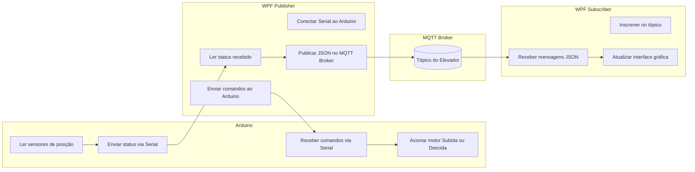
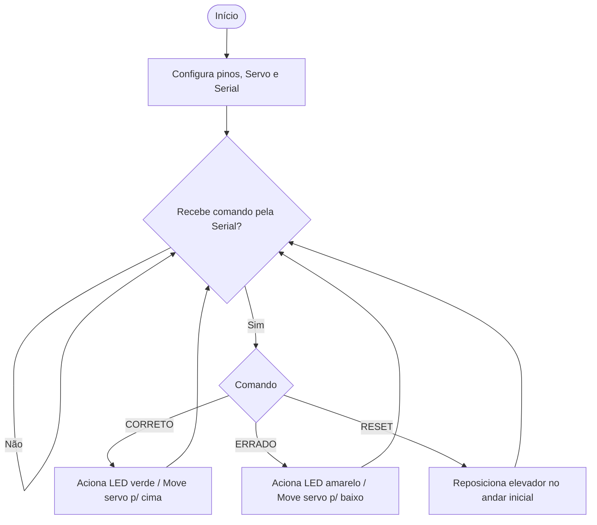
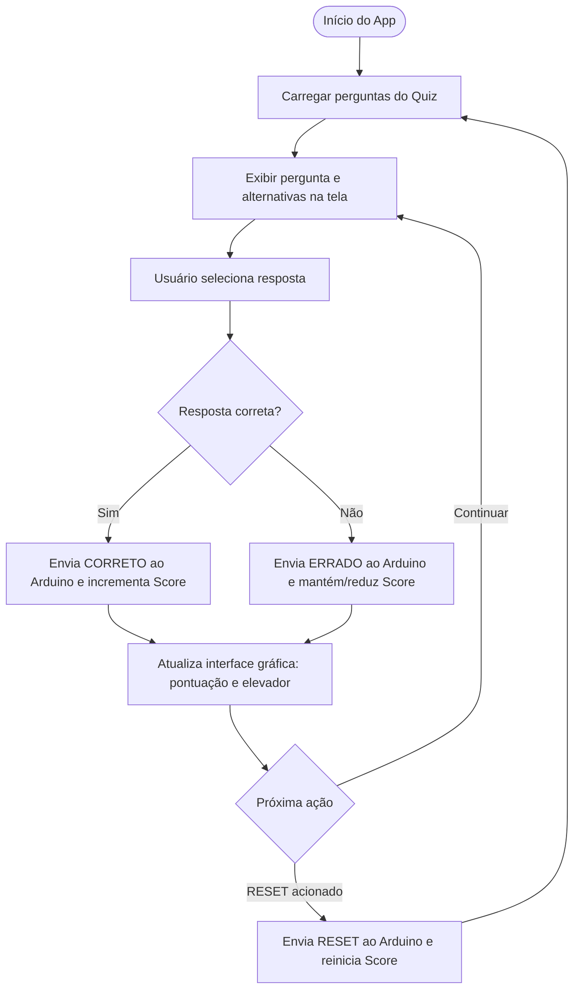
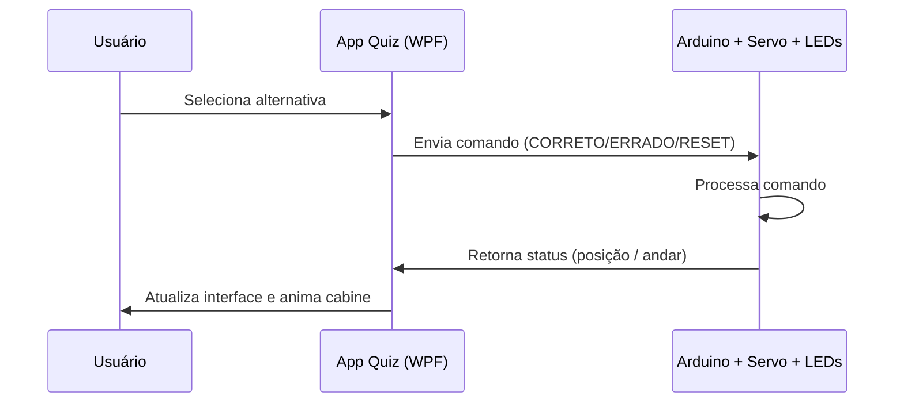

# 🎮 Elevador Lego Quiz Interativo

Projeto desenvolvido para promover **gamificação e interatividade** entre estudantes, utilizando:
- 🚀 **Arduino** para controle físico (servo e LEDs)  
- 🖥️ **Aplicação WPF** para o quiz interativo  
- 📡 Comunicação **Serial** entre software e hardware  

Este sistema integra **lógica de programação**, **eletrônica aplicada** e **gamificação educacional**, simulando o funcionamento de um elevador que se move conforme os acertos ou erros das respostas no quiz.

---

## 🏗️ Estrutura Geral do Projeto

### 🔹 Arduino – Controle Físico

### 🔹 Aplicação WPF – Quiz Interativo

### 🔹 Integração Quiz ↔ Arduino

## 📸 Imagens do Projeto
As imagens do projeto estão na pasta `Imagens/`:

### 📸 Vista frontal
  

### 📸 Vista Lateral
  

### 📸 Vista Lateral
  

### 📸 Interface
  

### 📸 Mensagem de erro
  

### 📸 Mensagem final
  

---

## 🚀 Conclusão

### Este projeto une lógica de programação, IoT educacional e aprendizagem baseada em jogos, sendo ideal para:

  💡 Aulas de programação e eletrônica

  🏫 Atividades de robótica educacional

  🎓 Projetos de interdisciplinaridade SENAI/SESI

---
